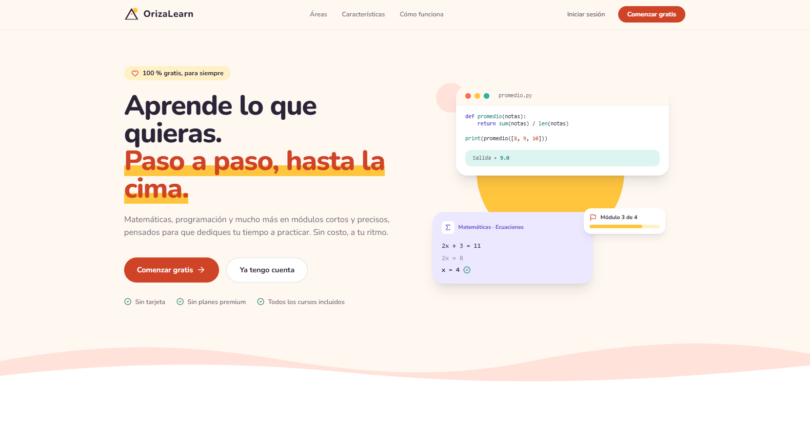
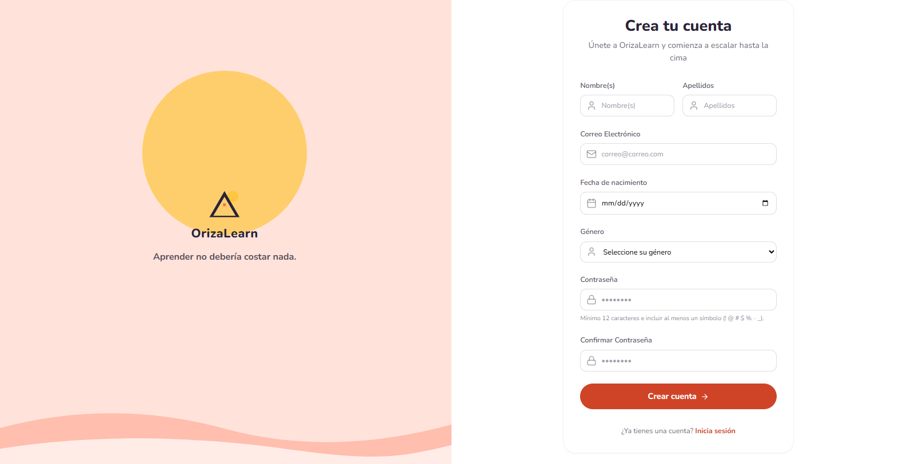
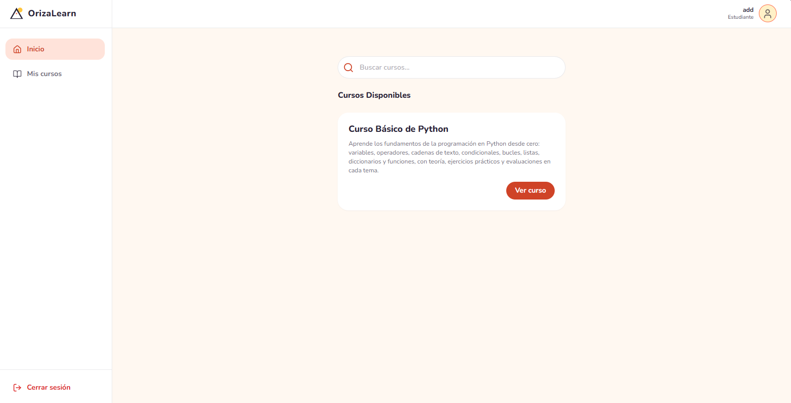
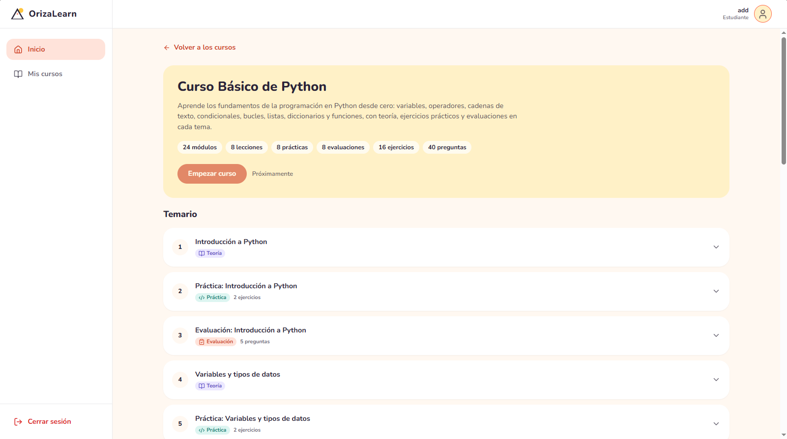
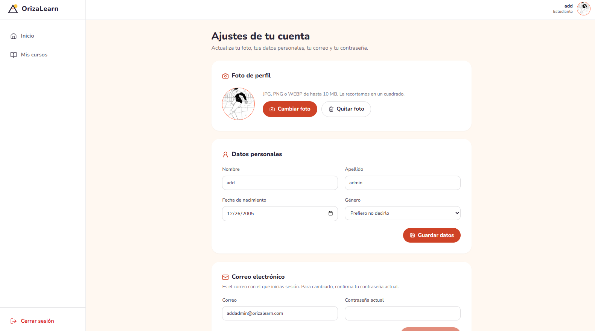

<div align="center">


# OrizaLearn

**Aprende lo que quieras. Paso a paso, hasta la cima.**

Plataforma de aprendizaje 100 % gratuita: matemáticas, programación y mucho más,<br />
en módulos cortos y precisos pensados para que dediques tu tiempo a practicar.


</div>



## ¿Por qué OrizaLearn?

Creemos que aprender no debería tener precio. En OrizaLearn no hay suscripciones: al registrarte tienes acceso a **todo el catálogo**, y tú decides qué aprender y cuándo.

## Características

- 🧩 **Módulos cortos y precisos** — contenido directo al punto, dividido en pasos que puedes completar en una sola sesión.
- ✍️ **Práctica primero** — la mayor parte de tu tiempo la inviertes haciendo ejercicios, no solo leyendo.
- 💻 **Código que se ejecuta** — en los cursos de programación escribes y corres tu código en un entorno aislado y seguro, sin instalar nada.
- 📝 **Evaluaciones al final** — exámenes de opción múltiple para comprobar lo que aprendiste antes de seguir avanzando.
- 📚 **Catálogo completo** — todos los cursos están disponibles para cualquier usuario registrado.
- 🎁 **100 % gratuito** — hoy y siempre.

## Cómo se aprende

Cada curso se divide en temas, y cada tema sigue el mismo recorrido:

```
📖 Teoría  ──▶  🛠️ Práctica  ──▶  🏁 Evaluación
```

1. **Teoría:** una explicación breve con ejemplos.
2. **Práctica:** ejercicios guiados para aplicar lo aprendido.
3. **Evaluación:** preguntas de opción múltiple para confirmar que dominas el tema.

El primer curso disponible es **Python básico**: 8 temas, desde los primeros pasos hasta escribir tus propios programas.

## Galería

|                       Registro                        |                 Panel del estudiante                 |
| :---------------------------------------------------: | :--------------------------------------------------: |
|  |  |

|                Detalle de los cursos                 |                  Panel de ajustes                  |
| :--------------------------------------------------: | :------------------------------------------------: |
|  |  |

## Tecnologías

| Capa                | Herramientas                                                                                                                |
| ------------------- | --------------------------------------------------------------------------------------------------------------------------- |
| **Frontend**        | React 19, TypeScript, Vite, Tailwind CSS con la paleta propia _Amanecer_, tipografía Nunito e iconos de Lucide              |
| **Backend**         | FastAPI, SQLAlchemy 2, Pydantic y bcrypt para el cifrado de contraseñas                                                     |
| **Datos**           | PostgreSQL alojado en Supabase                                                                                              |
| **Infraestructura** | Docker para la API y para el entorno aislado donde se ejecuta el código de los estudiantes (sin red y con memoria limitada) |

## Estado del proyecto

OrizaLearn está en desarrollo activo. Esto es lo que ya funciona y lo que viene:

- [x] Página de inicio pública
- [x] Registro e inicio de sesión
- [x] API de cursos, módulos, ejercicios y preguntas
- [x] Ejecución segura de código Python en contenedores aislados
- [ ] Catálogo y detalle de cursos dentro del panel del estudiante
- [ ] Evaluaciones interactivas
- [x] Sesiones con JWT
- [ ] Calificación automática de ejercicios
- [ ] Seguimiento del progreso
- [ ] Verificación de correo electrónico

## Autor

Hecho con 🧡 por [YED-1](https://github.com/YED-1).
